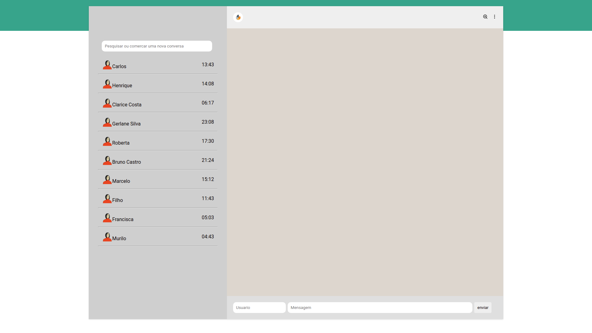

# WhatsLab

projeto Inpirado no WhatsApp

## Link do projeto
[Link Surge]()

## 🔧 Funçoes

### Função 01:
- Enviar Mensagem

 

### Computer Version:

## Veja o desenvolvimento do projeto:

Para ver o desenvolvimento acesse o planejamento:

## Feito Com:

### Support Ou Contato

Copyright © 2022 Carlos Henrique
